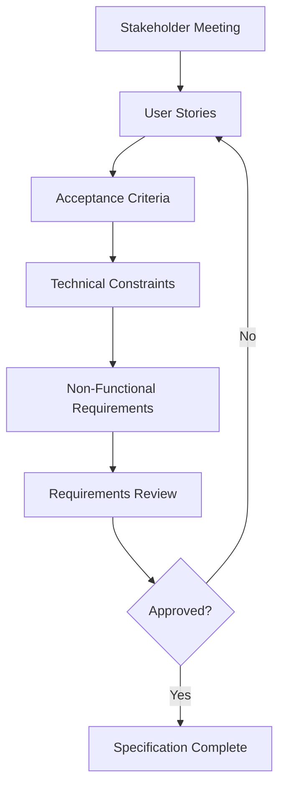
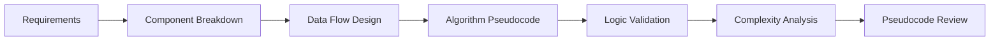
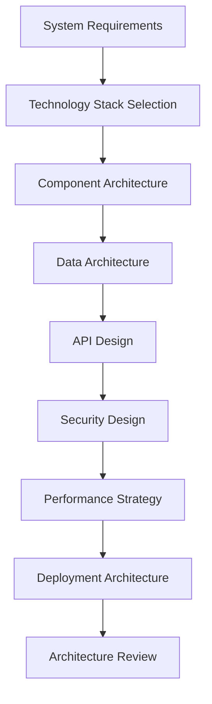
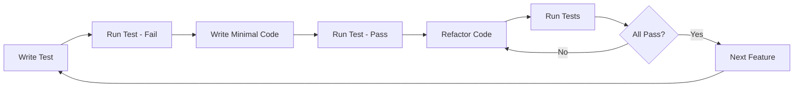
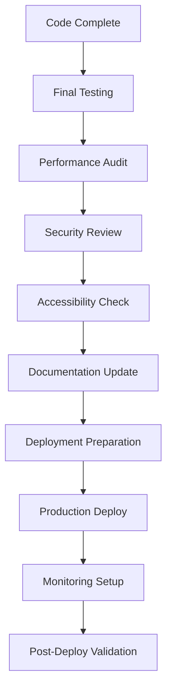

# SPARC Workflow Guide

## Overview

The SPARC methodology follows a systematic approach: **Specification** → **Pseudocode** → **Architecture** → **Refinement** → **Completion**. This document outlines the complete workflow for Next.js/Tailwind development.

## SPARC Phase Workflow

### Phase 1: Specification

#### 1.1 Requirements Gathering


#### 1.2 Specification Checklist
- [ ] **Functional Requirements Defined**
  - [ ] User stories written in Gherkin format
  - [ ] Acceptance criteria specified
  - [ ] Edge cases documented
  - [ ] Error scenarios covered

- [ ] **Technical Requirements Specified**
  - [ ] Performance targets set (Core Web Vitals)
  - [ ] Security requirements defined
  - [ ] Accessibility standards chosen (WCAG 2.1 AA)
  - [ ] Browser compatibility specified

- [ ] **Next.js Specific Requirements**
  - [ ] Rendering strategy chosen (SSG/SSR/ISR)
  - [ ] Data fetching patterns defined
  - [ ] SEO requirements documented
  - [ ] Image optimization needs specified

#### 1.3 Deliverables
```yaml
specification_outputs:
  - requirements_document: "Comprehensive requirements specification"
  - user_stories: "Behavioral specifications in Gherkin format"
  - api_contracts: "OpenAPI 3.0 specifications"
  - data_models: "Database schema and relationships"
  - ui_wireframes: "Basic layout and component structure"
```

### Phase 2: Pseudocode

#### 2.1 Algorithm Design Process


#### 2.2 Pseudocode Patterns for Next.js

##### Component Logic Pattern
```
COMPONENT UserProfile:
  INPUT: userId (string)
  
  INITIALIZE:
    SET loading = true
    SET user = null
    SET error = null
  
  ON_MOUNT:
    CALL fetchUserData(userId)
  
  FUNCTION fetchUserData(id):
    TRY:
      SET loading = true
      CALL API /api/users/${id}
      SET user = response.data
      SET loading = false
    CATCH error:
      SET error = error.message
      SET loading = false
  
  FUNCTION handleUpdateUser(userData):
    TRY:
      CALL API.PUT /api/users/${userId} WITH userData
      SET user = response.data
      SHOW success_message
    CATCH error:
      SHOW error_message
  
  RENDER:
    IF loading:
      RETURN LoadingSpinner
    IF error:
      RETURN ErrorMessage(error)
    IF user:
      RETURN UserForm(user, handleUpdateUser)
```

##### API Route Logic Pattern
```
API_ROUTE /api/users/:id:
  METHOD GET:
    INPUT: id (string)
    
    AUTHENTICATE:
      CHECK session exists
      IF no session:
        RETURN 401 Unauthorized
    
    VALIDATE:
      CHECK id is valid UUID
      IF invalid:
        RETURN 400 Bad Request
    
    PROCESS:
      QUERY database.users WHERE id = id
      IF user not found:
        RETURN 404 Not Found
      
      RETURN 200 OK WITH user_data
  
  METHOD PUT:
    INPUT: id (string), userData (object)
    
    AUTHENTICATE:
      CHECK session exists
      CHECK user owns resource OR is admin
      IF unauthorized:
        RETURN 403 Forbidden
    
    VALIDATE:
      VALIDATE userData against schema
      IF validation fails:
        RETURN 400 Bad Request WITH errors
    
    PROCESS:
      UPDATE database.users SET userData WHERE id = id
      RETURN 200 OK WITH updated_user
```

#### 2.3 Data Flow Pseudocode
```
DATA_FLOW UserDashboard:
  SERVER_SIDE:
    FUNCTION getServerSideProps():
      GET session from request
      IF no session:
        REDIRECT to /login
      
      FETCH user data from database
      FETCH user's posts from database
      RETURN props { user, posts }
  
  CLIENT_SIDE:
    FUNCTION DashboardComponent(props):
      SET user = props.user
      SET posts = props.posts
      SET newPosts = []
      
      USE_EFFECT on_mount:
        SUBSCRIBE to real-time updates
        ON new_post:
          ADD post to newPosts
      
      FUNCTION createPost(postData):
        OPTIMISTICALLY add to newPosts
        TRY:
          CALL API.POST /api/posts WITH postData
          UPDATE posts with response
        CATCH error:
          REMOVE optimistic post
          SHOW error
```

#### 2.4 State Management Pseudocode
```
STATE_MANAGEMENT ShoppingCart:
  GLOBAL_STATE:
    items: array of CartItem
    total: number
    isLoading: boolean
    error: string | null
  
  ACTIONS:
    ADD_ITEM(product, quantity):
      FIND existing item with product.id
      IF found:
        UPDATE item.quantity += quantity
      ELSE:
        ADD { product, quantity, subtotal } to items
      CALCULATE new total
    
    REMOVE_ITEM(productId):
      FILTER items where item.product.id !== productId
      CALCULATE new total
    
    UPDATE_QUANTITY(productId, newQuantity):
      IF newQuantity <= 0:
        CALL REMOVE_ITEM(productId)
      ELSE:
        UPDATE item.quantity = newQuantity
        CALCULATE new total
    
    CLEAR_CART():
      SET items = []
      SET total = 0
  
  SELECTORS:
    getItemCount():
      RETURN sum of all item quantities
    
    getCartTotal():
      RETURN total price of all items
    
    getItemById(productId):
      RETURN item where item.product.id === productId
```

### Phase 3: Architecture

#### 3.1 Architecture Design Process


#### 3.2 Next.js Architecture Decisions

##### Technology Stack Matrix
```yaml
technology_decisions:
  frontend:
    framework: "Next.js 14 (App Router)"
    styling: "Tailwind CSS"
    ui_library: "Radix UI + Shadcn/ui"
    state_management: "Zustand + SWR"
    forms: "React Hook Form + Zod"
    
  backend:
    database: "PostgreSQL + Prisma ORM"
    authentication: "NextAuth.js"
    caching: "Redis + Next.js Cache"
    file_storage: "AWS S3 / Cloudinary"
    
  deployment:
    hosting: "Vercel / AWS"
    database: "PlanetScale / Supabase"
    cdn: "Cloudflare / Vercel Edge"
    monitoring: "Sentry + Vercel Analytics"
```

##### Component Architecture Strategy
```typescript
// Architecture decision: Component composition pattern
interface ComponentArchitecture {
  // Atomic Design Pattern
  atoms: {
    examples: ["Button", "Input", "Label", "Icon"]
    purpose: "Basic building blocks"
    location: "components/ui/"
  }
  
  molecules: {
    examples: ["SearchBox", "FormField", "Card", "Modal"]
    purpose: "Simple component combinations"
    location: "components/molecules/"
  }
  
  organisms: {
    examples: ["Header", "ProductList", "CheckoutForm"]
    purpose: "Complex UI sections"
    location: "components/organisms/"
  }
  
  templates: {
    examples: ["DashboardLayout", "AuthLayout", "BlogLayout"]
    purpose: "Page structure and layout"
    location: "components/templates/"
  }
  
  pages: {
    examples: ["HomePage", "ProductPage", "UserDashboard"]
    purpose: "Complete page implementations"
    location: "app/*/page.tsx"
  }
}
```

#### 3.3 Data Architecture Design
```sql
-- Database schema design
CREATE TABLE users (
  id UUID PRIMARY KEY DEFAULT gen_random_uuid(),
  email VARCHAR(255) UNIQUE NOT NULL,
  name VARCHAR(100),
  avatar_url TEXT,
  role user_role DEFAULT 'user',
  email_verified BOOLEAN DEFAULT false,
  created_at TIMESTAMP DEFAULT now(),
  updated_at TIMESTAMP DEFAULT now()
);

CREATE INDEX idx_users_email ON users(email);
CREATE INDEX idx_users_role ON users(role);

CREATE TABLE posts (
  id UUID PRIMARY KEY DEFAULT gen_random_uuid(),
  title VARCHAR(200) NOT NULL,
  slug VARCHAR(200) UNIQUE NOT NULL,
  content TEXT,
  excerpt TEXT,
  status post_status DEFAULT 'draft',
  published_at TIMESTAMP,
  author_id UUID REFERENCES users(id) ON DELETE CASCADE,
  created_at TIMESTAMP DEFAULT now(),
  updated_at TIMESTAMP DEFAULT now()
);

CREATE INDEX idx_posts_author ON posts(author_id);
CREATE INDEX idx_posts_status ON posts(status);
CREATE INDEX idx_posts_published ON posts(published_at DESC);
```

### Phase 4: Refinement (TDD Implementation)

#### 4.1 Test-Driven Development Workflow


#### 4.2 TDD Implementation Pattern

##### Step 1: Write Failing Tests
```typescript
// __tests__/components/UserProfile.test.tsx
import { render, screen, waitFor } from '@testing-library/react'
import { UserProfile } from '@/components/UserProfile'
import { server } from '@/mocks/server'
import { rest } from 'msw'

describe('UserProfile', () => {
  it('displays user information after loading', async () => {
    // Arrange
    const mockUser = {
      id: '1',
      name: 'John Doe',
      email: 'john@example.com'
    }
    
    server.use(
      rest.get('/api/users/1', (req, res, ctx) => {
        return res(ctx.json(mockUser))
      })
    )
    
    // Act
    render(<UserProfile userId="1" />)
    
    // Assert
    expect(screen.getByText('Loading...')).toBeInTheDocument()
    
    await waitFor(() => {
      expect(screen.getByText('John Doe')).toBeInTheDocument()
      expect(screen.getByText('john@example.com')).toBeInTheDocument()
    })
    
    expect(screen.queryByText('Loading...')).not.toBeInTheDocument()
  })
})
```

##### Step 2: Implement Component
```typescript
// components/UserProfile.tsx
'use client'

import { useState, useEffect } from 'react'

interface User {
  id: string
  name: string
  email: string
}

interface UserProfileProps {
  userId: string
}

export function UserProfile({ userId }: UserProfileProps) {
  const [user, setUser] = useState<User | null>(null)
  const [loading, setLoading] = useState(true)
  const [error, setError] = useState<string | null>(null)
  
  useEffect(() => {
    async function fetchUser() {
      try {
        const response = await fetch(`/api/users/${userId}`)
        if (!response.ok) {
          throw new Error('Failed to fetch user')
        }
        const userData = await response.json()
        setUser(userData)
      } catch (err) {
        setError(err instanceof Error ? err.message : 'Unknown error')
      } finally {
        setLoading(false)
      }
    }
    
    fetchUser()
  }, [userId])
  
  if (loading) return <div>Loading...</div>
  if (error) return <div>Error: {error}</div>
  if (!user) return <div>User not found</div>
  
  return (
    <div>
      <h2>{user.name}</h2>
      <p>{user.email}</p>
    </div>
  )
}
```

##### Step 3: Add API Route Tests
```typescript
// __tests__/api/users/[id]/route.test.ts
import { GET } from '@/app/api/users/[id]/route'
import { NextRequest } from 'next/server'

// Mock dependencies
jest.mock('@/lib/db')
jest.mock('@/lib/auth')

describe('/api/users/[id]', () => {
  it('returns user data for valid ID', async () => {
    // Mock authenticated user
    ;(auth as jest.Mock).mockResolvedValue({
      user: { id: '1', role: 'user' }
    })
    
    // Mock database response
    ;(db.user.findUnique as jest.Mock).mockResolvedValue({
      id: '1',
      name: 'John Doe',
      email: 'john@example.com'
    })
    
    const request = new NextRequest('http://localhost/api/users/1')
    const params = { id: '1' }
    
    const response = await GET(request, { params })
    const data = await response.json()
    
    expect(response.status).toBe(200)
    expect(data.name).toBe('John Doe')
    expect(data.email).toBe('john@example.com')
  })
})
```

##### Step 4: Implement API Route
```typescript
// app/api/users/[id]/route.ts
import { auth } from '@/lib/auth'
import { db } from '@/lib/db'
import { NextRequest, NextResponse } from 'next/server'

export async function GET(
  request: NextRequest,
  { params }: { params: { id: string } }
) {
  try {
    // Authentication
    const session = await auth()
    if (!session?.user) {
      return NextResponse.json(
        { error: 'Unauthorized' },
        { status: 401 }
      )
    }
    
    // Validation
    const { id } = params
    if (!id) {
      return NextResponse.json(
        { error: 'User ID required' },
        { status: 400 }
      )
    }
    
    // Database query
    const user = await db.user.findUnique({
      where: { id },
      select: {
        id: true,
        name: true,
        email: true,
        avatar: true,
        createdAt: true
      }
    })
    
    if (!user) {
      return NextResponse.json(
        { error: 'User not found' },
        { status: 404 }
      )
    }
    
    return NextResponse.json(user)
    
  } catch (error) {
    console.error('User fetch error:', error)
    return NextResponse.json(
      { error: 'Internal server error' },
      { status: 500 }
    )
  }
}
```

#### 4.3 Integration Testing
```typescript
// __tests__/integration/user-profile.test.tsx
import { render, screen, waitFor } from '@testing-library/react'
import { UserProfile } from '@/components/UserProfile'
import { QueryClient, QueryClientProvider } from '@tanstack/react-query'

// Integration test with real API calls (using test database)
describe('UserProfile Integration', () => {
  let queryClient: QueryClient
  
  beforeEach(() => {
    queryClient = new QueryClient({
      defaultOptions: {
        queries: { retry: false },
        mutations: { retry: false }
      }
    })
  })
  
  it('loads and displays user profile from API', async () => {
    render(
      <QueryClientProvider client={queryClient}>
        <UserProfile userId="test-user-1" />
      </QueryClientProvider>
    )
    
    // Wait for API call and data display
    await waitFor(
      () => {
        expect(screen.getByText('Test User')).toBeInTheDocument()
      },
      { timeout: 5000 }
    )
    
    expect(screen.getByText('test@example.com')).toBeInTheDocument()
  })
})
```

### Phase 5: Completion

#### 5.1 Final Integration Workflow


#### 5.2 Pre-Production Checklist

##### Code Quality
- [ ] **Test Coverage**
  - [ ] Unit tests: 80%+ coverage
  - [ ] Integration tests: Key user flows covered
  - [ ] E2E tests: Critical paths validated
  - [ ] All tests passing in CI/CD

- [ ] **Code Review**
  - [ ] Peer review completed
  - [ ] Security review passed
  - [ ] Performance review completed
  - [ ] Accessibility review done

##### Performance
- [ ] **Core Web Vitals**
  - [ ] LCP < 2.5 seconds
  - [ ] FID < 100 milliseconds
  - [ ] CLS < 0.1
  - [ ] Lighthouse score > 90

- [ ] **Bundle Analysis**
  - [ ] JavaScript bundle < 200KB gzipped
  - [ ] No duplicate dependencies
  - [ ] Tree shaking verified
  - [ ] Code splitting implemented

##### Security
- [ ] **Security Measures**
  - [ ] Authentication implemented
  - [ ] Authorization checks in place
  - [ ] Input validation on all endpoints
  - [ ] SQL injection prevention verified
  - [ ] XSS protection implemented
  - [ ] CSRF protection enabled

##### Accessibility
- [ ] **WCAG 2.1 AA Compliance**
  - [ ] Keyboard navigation works
  - [ ] Screen reader compatibility
  - [ ] Color contrast meets standards
  - [ ] Alt text for all images
  - [ ] Form labels properly associated

#### 5.3 Deployment Process

##### Environment Configuration
```bash
# Production environment setup
NODE_ENV=production
NEXT_PUBLIC_APP_URL=https://yourapp.com
DATABASE_URL=your_production_db_url
NEXTAUTH_URL=https://yourapp.com
NEXTAUTH_SECRET=your_secure_secret
GOOGLE_CLIENT_ID=your_google_client_id
GOOGLE_CLIENT_SECRET=your_google_client_secret
REDIS_URL=your_redis_url
```

##### Build and Deploy Script
```bash
#!/bin/bash
# deploy.sh

set -e

echo "🚀 Starting deployment process..."

# Install dependencies
npm ci

# Run tests
echo "🧪 Running tests..."
npm run test:ci

# Type checking
echo "🔍 Type checking..."
npm run typecheck

# Linting
echo "📝 Linting..."
npm run lint

# Build application
echo "🔨 Building application..."
npm run build

# Database migrations
echo "🗄️ Running database migrations..."
npx prisma migrate deploy

# Deploy to production
echo "🚀 Deploying to production..."
vercel --prod

echo "✅ Deployment completed successfully!"
```

#### 5.4 Post-Deployment Monitoring

##### Monitoring Setup
```typescript
// lib/monitoring.ts
import * as Sentry from '@sentry/nextjs'

// Error tracking
export function initMonitoring() {
  Sentry.init({
    dsn: process.env.NEXT_PUBLIC_SENTRY_DSN,
    environment: process.env.NODE_ENV,
    tracesSampleRate: 1.0,
  })
}

// Performance monitoring
export function trackPerformance(name: string, duration: number) {
  Sentry.addBreadcrumb({
    message: `Performance: ${name}`,
    data: { duration },
    level: 'info',
  })
}

// User analytics
export function trackUserAction(action: string, data?: Record<string, any>) {
  if (typeof window !== 'undefined') {
    gtag('event', action, {
      custom_map: data,
    })
  }
}
```

##### Health Check Implementation
```typescript
// app/api/health/route.ts
import { NextResponse } from 'next/server'
import { db } from '@/lib/db'

export async function GET() {
  try {
    // Database health check
    await db.$queryRaw`SELECT 1`
    
    // External service checks
    const checks = {
      database: 'healthy',
      timestamp: new Date().toISOString(),
      version: process.env.npm_package_version,
      uptime: process.uptime(),
    }
    
    return NextResponse.json(checks)
  } catch (error) {
    return NextResponse.json(
      { 
        status: 'unhealthy',
        error: error instanceof Error ? error.message : 'Unknown error'
      },
      { status: 500 }
    )
  }
}
```

## SPARC Workflow Tools Integration

### Claude Flow Commands
```bash
# Run complete SPARC workflow
npx claude-flow sparc pipeline "Build user authentication system"

# Run specific phases
npx claude-flow sparc run spec-pseudocode "User login feature"
npx claude-flow sparc run architect "Authentication system design"
npx claude-flow sparc tdd "Login component with tests"

# Batch processing
npx claude-flow sparc batch "spec-pseudocode,architect" "E-commerce cart system"

# Concurrent task processing
npx claude-flow sparc concurrent tdd tasks.txt
```

### Task Orchestration
```yaml
# tasks.yaml - Multi-agent workflow
phases:
  specification:
    agents: ["requirements-analyst", "product-owner", "technical-writer"]
    deliverables: ["requirements.md", "user-stories.md", "api-spec.yaml"]
    
  pseudocode:
    agents: ["algorithm-designer", "system-architect"]
    deliverables: ["algorithms.md", "data-flow.md"]
    
  architecture:
    agents: ["system-architect", "security-expert", "performance-engineer"]
    deliverables: ["architecture.md", "security-plan.md", "performance-plan.md"]
    
  refinement:
    agents: ["tdd-developer", "frontend-expert", "backend-expert", "qa-engineer"]
    deliverables: ["components/", "api/", "tests/"]
    
  completion:
    agents: ["devops-engineer", "qa-lead", "security-auditor"]
    deliverables: ["deployment/", "monitoring/", "documentation/"]
```

This comprehensive workflow guide ensures systematic development following SPARC methodology with Next.js best practices.